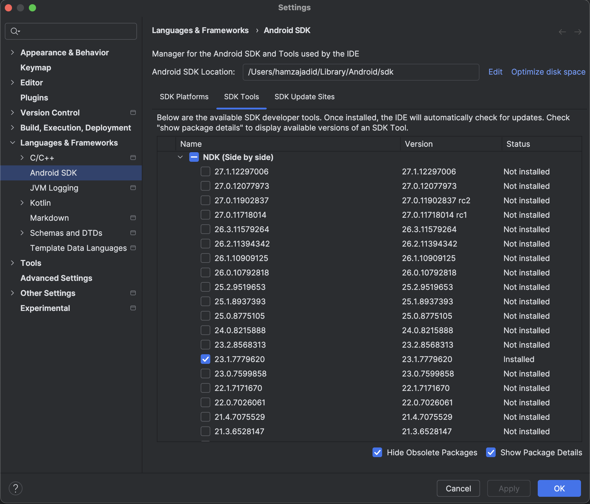

# Contribution Guide

This guide is mostly for macOS users, if you found your way to build it on windows or linux feel free to open a PR!

## Apple

### System Requirements

It only requires `XCode` and the iOS target triplets

```shell
rustup target add \
    aarch64-apple-ios \
    x86_64-apple-ios \
    aarch64-apple-ios-sim
```

### Swift Package Manager

We're using SPM (swift package manager), a limitation while using an `xcframework` locally is having to specify the path,
which doesn't play well when publishing on remote. A work around for this limitation is to set the `useLocalFramework` to
`true` and return it back to `false` before pushing.

### Building

To generate swift bindings run:

```shell
make apple
```

This will generate the swift bindings and create an `xcframework` with the built rust static libraries.

### Releasing

Similar to the building command but we should pass `--release`

```shell
make apple -- --release
```

This will create a ZIP archive of the `xcframework` and update `Package.swift` with the computed checksum.
This is only needed when cutting a new release, not for local development.

## Android

### System Requirements

#### Android Studio

Follow the installation instructions on the [official website](https://developer.android.com/studio)

#### Java

Install java 17

```shell
brew install --cask zulu@17
```

#### NDK (native development kit)

We're writing native code so NDK is required for this task, and we're using
[cargo-ndk](https://github.com/bbqsrc/cargo-ndk)

To install cargo-ndk run:

```shell
cargo install cargo-ndk
```

And add the android target triplets

```shell
rustup target add \
    aarch64-linux-android \
    armv7-linux-androideabi \
    x86_64-linux-android \
    i686-linux-android
```

And to install the NDK itself, in Android studio open `Settings` → `Languages & Frameworks` →
`Android SDK` → `SDK Tools`

Check the `Show Package Details` and pick `NDK (Side by side)` version `23.1.7779620`



#### Add to Path

Add the following lines to your `~/.zprofile` or `~/.zshrc` (if you are using bash, then `~/.bash_profile`
or `~/.bashrc`) config file:

```shell
export ANDROID_HOME=$HOME/Library/Android/sdk
export PATH=$PATH:$ANDROID_HOME/emulator
export PATH=$PATH:$ANDROID_HOME/platform-tools
export ANDROID_NDK_HOME=$ANDROID_HOME/ndk/23.1.7779620
```

Run source `~/.zprofile` (or source` ~/.bash_profile` for bash) to load the config into your current shell.
Verify that `ANDROID_HOME` has been set by running `echo $ANDROID_HOME` and the appropriate directories have
been added to your path by running `echo $PATH`.

> Please make sure you use the correct Android SDK path. You can find the actual location of the SDK in the
> Android Studio "Settings" dialog, under Languages & Frameworks → Android SDK.

### Building

Change directory into the android directory and run:

```shell
./gradlew :bindings:assembleDebug
```

This will generate the kotlin bindings and link `.so` files to the `jni` directory.

## Documentation

We're using [mdbook](https://github.com/rust-lang/mdBook) as a general purpose documentation tool.
Run `cargo install mdbook` to install it. And to run it open the docs directory in terminal and
run `mdbook server --open`.
